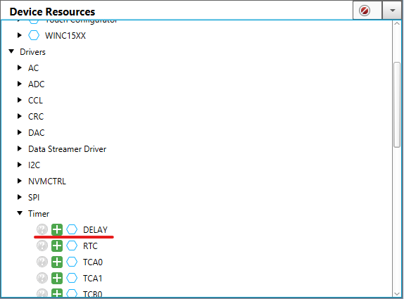

<!-- Please do not change this logo with link -->
[](https://www.microchip.com)

# LED Blink using software delay

This example shows how to configure an LED to blink periodically using drivers in MPLAB Code Configurator (MCC). The example uses the Pin Manager to configure the pin and generate an API with which the pin is later interfaced. Also, the delay driver is used to implement periodic timeouts between each time the pin output is toggled.

<!--  -->
<p>
    
</p>


## Related Documentation

- [AVR128DB48 device page](https://www.microchip.com/wwwproducts/en/AVR128DB48)
- [MPLAB® Code Configurator](https://www.microchip.com/en-us/development-tools-tools-and-software/embedded-software-center/mplab-code-configurator)


## Software Used

- [MPLAB® X IDE v6.0](https://www.microchip.com/mplab/mplab-x-ide) or newer
- [MPLAB® Xpress IDE](https://www.microchip.com/xpress) (alternative to MPLAB X IDE)
- [XC8 Compiler v2.40](https://www.microchip.com/mplab/compilers) or newer
- [MPLAB® Code Configurator (MCC) v5.1.17](https://www.microchip.com/mplab/mplab-code-configurator) or newer
- [MPLAB® Melody Library 1.37.26 or newer](https://www.microchip.com/mplab/mplab-code-configurator) or newer
- [MCC Device Libraries 8-bit AVR MCUs 2.7.0](https://www.microchip.com/mplab/mplab-code-configurator) or newer
- [Microchip AVR128DB48 Device Support Pack AVR-Dx_DFP 2.3.272](https://packs.download.microchip.com/) or newer

## Hardware Used

- [AVR128DB48 Curiosity Nano](https://www.microchip.com/DevelopmentTools/ProductDetails/PartNO/EV35L43A)


## Setup
This example uses MCC with the Melody library, as shown below.

### Delay Driver
The Delay Driver was simply added to the project by locating it in the Device Resources pane on the left side in MCC and clicking the green plus icon as shown in the image below.

*Device Resources*




When the Delay Driver was added, it was shown in the Project Resources and in the Builder view as seen below.

*Project Resources*


*Builder*


### Pin Configuration
The Pin controlling the onboard LED on the Curiosity Nano board was configured using the Pins Grid View. The Pins Grid View is accessed by clicking on the Pins line in Project Resources.

*Project Resources*


Then the pin connected to the LED, PB3, was selected as an output by clicking the corresponding padlock symbol.

*Pins Grid View*


The pin was also configured with a custom name to make the generated API more readable.

*Custom Pin Name*


### Code Implementation
First, the delay functions were included in the application by including the MCC generated API:
```c
#include "mcc_generated_files/timer/delay.h"
```

Then the pin manager and delay APIs were used to toggle the LED-pin once every 500 ms:
```c
while(1)
    {
        LED_PIN_Toggle();
        DELAY_milliseconds(500);
    }    
```


## Operation
After having flashed the application to the AVR128DB48 Curiosity Nano, the onboard LED blinks with a frequency of 1 Hz.


## Summary

The example has shown how MCC can be used to create APIs which may easily be used in application code. The use of such APIs make the code readable and simple, while the functions are generated automatically as configured in MCC.
